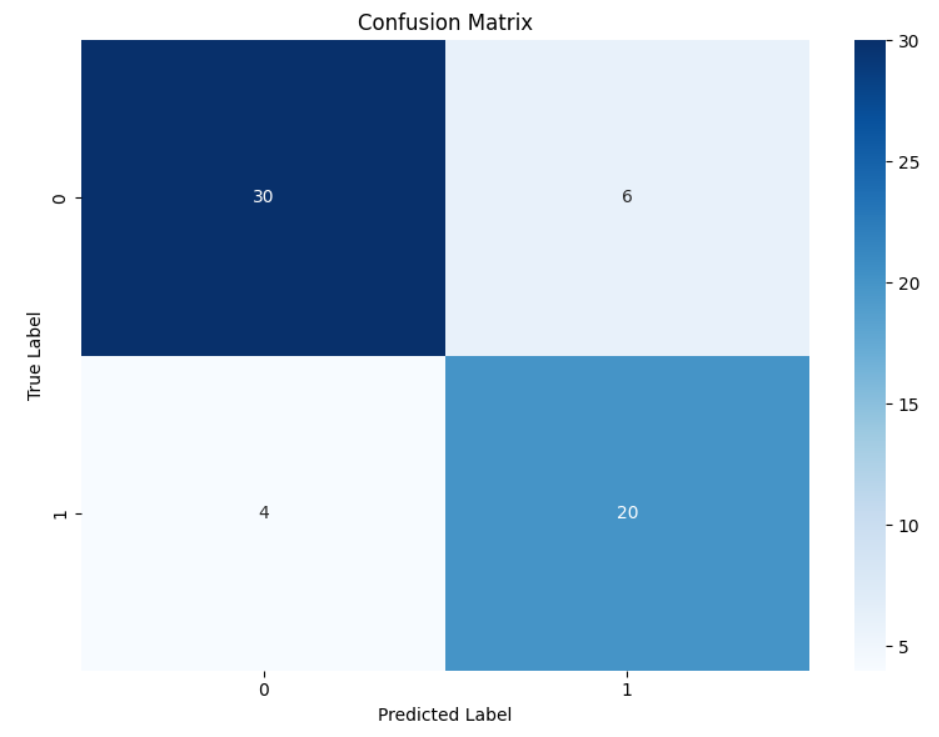
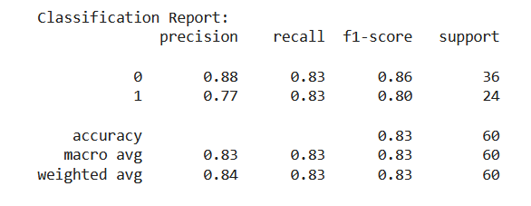

# Heart Disease Prediction Using FTTransformer Encoder

## Overview

This project aims to predict heart disease using data from the UCI Machine Learning Repository. The prediction is performed using a transformer-based neural network model (`FTTransformer`) implemented with PyTorch.

## Dataset

The dataset used is the Cleveland Heart Disease dataset from the UCI Machine Learning Repository:
- **URL**: [Cleveland Heart Disease Dataset](https://archive.ics.uci.edu/ml/machine-learning-databases/heart-disease/processed.cleveland.data)
- The dataset contains various medical features such as age, sex, cholesterol level, and more, which are used to predict the presence of heart disease.

## Methodology

### 1. Data Loading and Preprocessing

- **Data Loading**: The dataset is loaded using Pandas with specified column names, and missing values (represented as `?`) are handled.
- **Preprocessing**:
  - Dropped rows with missing values.
  - The target variable was binarized to classify whether a person has heart disease (`1`) or not (`0`).

### 2. Feature Engineering

- Added new features such as:
  - **Age Group**: Binned `age` into categories (`young`, `middle`, `senior`, `elderly`).
  - **Age-Thalach Interaction**: Created a feature by multiplying `age` and `thalach`.
  - **Thalach Bin**: Discretized `thalach` into quantiles (`low`, `medium-low`, `medium-high`, `high`).
- One-hot encoding was used for categorical variables to make them compatible with the model.

### 3. Data Splitting and Scaling

- Split the dataset into training and test sets using an 80/20 split.
- Scaled the features using `StandardScaler` to standardize the input data for better model performance.

### 4. Model Definition: FTTransformer

- Used a transformer-based architecture (`FTTransformer`) to predict heart disease.
- The model consists of:
  - An embedding layer to transform input features.
  - Transformer encoder layers for learning complex relationships.
  - A fully connected output layer for binary classification.

### 5. Model Training

- Used **Cross Entropy Loss** as the loss function.
- Optimized the model using **Adam Optimizer** with a learning rate of 0.001.
- Trained for **500 epochs** with a batch size of **64**.

### 6. Model Evaluation

- Evaluated using **Accuracy**, **Precision**, **Recall**, and **F1-Score**.
- Generated a **Confusion Matrix** to understand true positives, false positives, true negatives, and false negatives.

## Results

### Confusion Matrix

### Classification Report

### Brief Assessment

The model achieved an overall accuracy of **83%**. The precision, recall, and F1-score values for the two classes are as follows:

- **Class 0 (No Heart Disease)**:
  - **Precision**: 0.88
  - **Recall**: 0.83
  - **F1-Score**: 0.86

- **Class 1 (Heart Disease)**:
  - **Precision**: 0.77
  - **Recall**: 0.83
  - **F1-Score**: 0.80

These values indicate good performance in distinguishing between the presence and absence of heart disease, with some room for improvement in precision and recall for the heart disease class.

